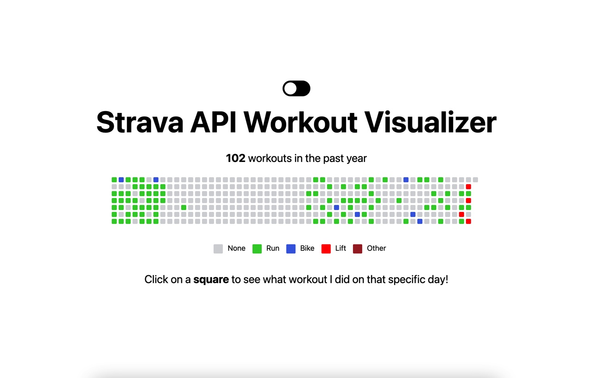

## Strava API Workout Visualizer

An app which connects to the Strava API and visualizes my personal Strava exercises. Each color-coded grid represents a day in the past year, and clicking on the grids would yield additional workout info for that particular day. 

